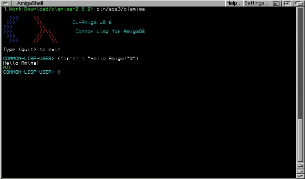
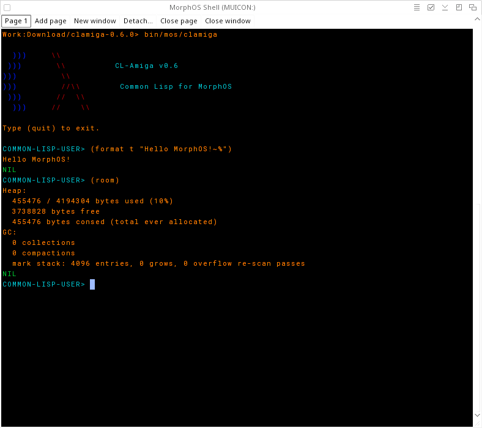
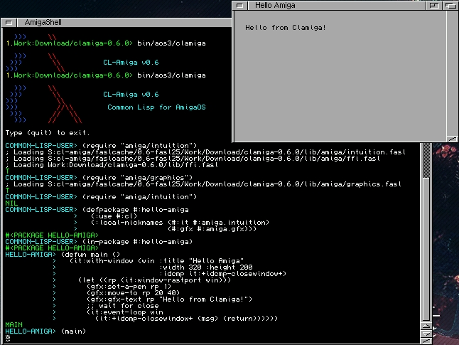
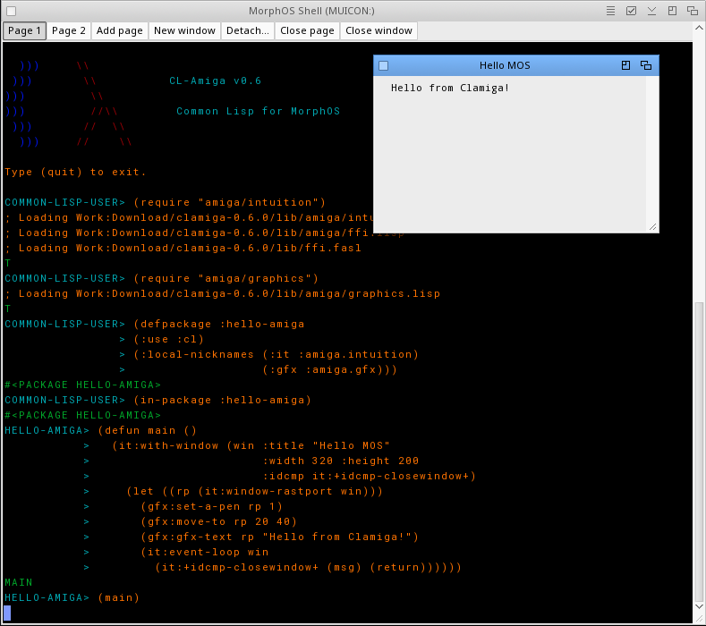
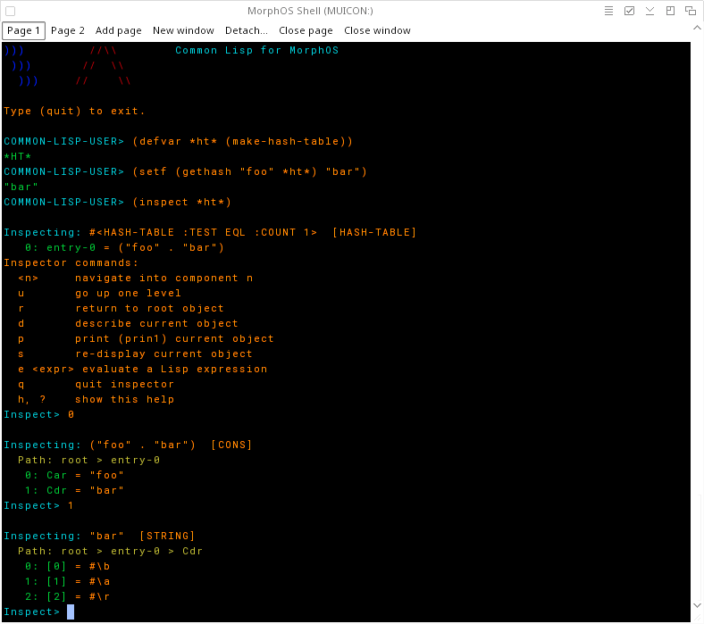

### Clamiga -- Common Lisp for the Amiga

After the ACE BASIC posts of the last month, this one is about a different project I have been working on for the last half year: **CL-Amiga**, or **Clamiga** for short. It is a Common Lisp implementation built for the Amiga family -- classic AmigaOS 3 on 68k and MorphOS as a fully native PPC build, AROS and AmigaOS 4 maybe to come -- but it also runs on macOS (I use it as my main Common Lisp impl here) and Linux, where most of the development actually happens.

The name is simple: *Common Lisp for the Amiga* becomes CL-Amiga, and said out loud that is "Clamiga". And since *amiga* is Spanish/Portuguese for a (female) friend (Amiga users should know), the name does double duty: the Lisp that runs on your Amiga, and the Lisp that is your *amiga* ;).

(see project link at the bottom)



### A few words about Common Lisp

Common Lisp is one of the older programming languages still in active use. Yes, it is used in industry and many other domains. The ANSI standard is from 1994 and has not changed since -- and yet the language feels surprisingly modern (usually old Common Lisp programs that are ANSI compliant compile also on modern compilers). It has a full object system with multiple dispatch (CLOS), a condition system that goes beyond exceptions, macros that let you extend the language itself, and an incredibly interactive, image-based development style where you compile and redefine functions in a live running system. Many "new" language features of the last decades existed in Common Lisp long before.

I won't repeat all of that here. If you want a proper introduction, I wrote a primer a few years ago: <a href="/blog/Common+Lisp+-+Oldie+but+goldie" class="link">[Common Lisp - Oldie but goldie]</a>. There is also a post about <a href="/blog/Functional+Programming+in+(Common)+Lisp" class="link">[functional programming in Common Lisp]</a> if you find that interesting.

### Why another Common Lisp implementation?

There are excellent Common Lisp implementations out there -- SBCL, CCL, ECL, Clasp, CLISP (unmaintained in decades), or even commercial ones like LispWorks and Allegro.

**But none of them run on the Amiga.** The high-performance implementations (SBCL, CCL) are native-code compilers tied to modern architectures -- x86-64, ARM, PPC -- with no 68k backend and a memory footprint measured in tens of megabytes. Clasp is built on LLVM. CLISP, the closest in spirit -- a compact bytecode interpreter written in C -- is unmaintained for many years and has not had a AmigaOS build in decades.

Clamiga is built to run on m68k Amigas. It has a self-contained bytecode VM in portable C with no external runtime dependencies -- no libffi, no LLVM, no C compiler needed at runtime. A full Common Lisp implementation, its language and runtime features, means that it won't break performance records compared to just C or assembler programs on the Amiga. So it's not meant to code games with it that need super-fast scrolling or so. The m68k-JIT tries to squeeze more performance out of it, but it has its limits.

It has other features, i.e. the full numeric tower, from bits (bitvector) over ratios and complex numbers to big integers out of the box. It has a repl for interactive development, a debugger, and an inspector. Recilience using the condition system, restarts, and all that (see my Oldie but Goldie article above). You have sockets, threads, file system access, streams that are implemented natively to the AmigaOS APIs so that Common Lisp code stays compliant and often needs no porting to other systems. CLOS (Common Lisp Object System) is the most advanced object system I came across. And you could do functional programming also if you wanted to.

But let's look at a few more technical things.

### Some upfront glossary that is mentioned below

- <a href="https://asdf.common-lisp.dev/" class="link" target="_blank">[ASDF]</a>: Another System Definition Facility, is the de facto standard build facility for Common Lisp. Most Common Lisp 'libraries' (in ASDF called 'systems') are built with ASDF. Practically all Common Lisp implementations that are maintained today ship ASDF with it and so does Clamiga.
- FASL: FASt Load. FASL files are generated when compiling Lisp source code, i.e. via (compile-file "foo.lisp"). FASL files are faster to load than Lisp source code files because they are already compiled to a serialised format. All Common Lisp variants implement FASL, so does Clamiga. The Clamiga generated FASL files, when generated on either m68k or PPC, are interchangeable between those two architectures.
- <a href="https://www.quicklisp.org/beta/" class="link" target="_blank">[Quicklisp]</a> is a library manager for Common Lisp containing over 1,500 libraries. Clamiga ships with compatibility shims so that (theoretically) many libraries available on Quicklisp can be used. Though many require more computing power and are probably out of reach for a m68020.

### How it works

Clamiga is a single-pass compiler from S-expressions to bytecode, executed by a stack-based VM. A few design decisions follow directly from the Amiga constraint:

- **Tagged 32-bit values.** Every Lisp value is a 32-bit word. Heap pointers are arena-relative offsets, which keeps the whole object model 32-bit-clean and compact (see below for packed arrays).
- **Compacting GC.** A small heap fragments quickly. The mark-and-sweep collector can slide-compact the heap when fragmentation blocks an allocation, so a long-running session on 4 or 8 MB does not slowly die.
- **Architecture-agnostic bytecode.** Because execution is bytecode, the same compiled Lisp runs unchanged on 68k and PowerPC. The compiled FASL files are byte-compatible between AmigaOS 3 and MorphOS.

The nice side effect of the portable C core: the exact same system builds and runs on macOS and Linux. Development, debugging, and most testing happen on a fast host, and the result behaves (in most cases) identically on the Amiga.

### On the classic Amiga: living with 4 MB, well, less also works

Even with accelerators providing more RAM, memory is still often a constraint on a 68k Amiga, and a lot of work went into respecting it.

The full Common Lisp core -- CLOS, conditions, the numeric tower, format, loop -- boots in about **0.5 MB** of heap. For writing simple programs, `clamiga --heap 1M` is enough. The defaults scale up from there:

| Use case                                   | Heap        | Stack          |
|--------------------------------------------|-------------|----------------|
| Simple programs (no Quicklisp/ASDF)        | `--heap 1M` | 64K (default)  |
| Small to medium programs                   | 4M (default)| 64K (default)  |
| Loading ASDF                               | `--heap 11M`| 64K (default)  |
| Quicklisp + quickload libraries            | `--heap 24M`| `stack 128000` |

A few things make small heaps practical:

- **Packed byte vectors**: `(make-array n :element-type '(unsigned-byte 8))` stores 1 byte per element instead of a 4-byte tagged value, and the GC never scans the contents. On an 8 MB machine that makes I/O buffers, graphics plane data, and audio samples 4x smaller and essentially free to collect. There are packed byte vectors for 16-bit values as well.
- **Bulk sequence I/O**: `read-sequence` and `write-sequence` on byte vectors move whole chunks per OS call instead of one VM round-trip per byte. On a 14 MHz 68020 that turns loading a 20 KB asset file from seconds into file-I/O speed.
- **Precompiled boot FASLs**: the standard library and CLOS ship precompiled. On the low-end 020 baseline this cuts cold boot from ~92 seconds to ~9 seconds.

And if the stack is too small for a deeply nested form, Clamiga signals a clean `C stack nearly exhausted` error telling you to raise it -- it doesn't corrupt the session.

### The m68k JIT

On the AmigaOS build (68020+), Clamiga translates bytecode functions to native m68k machine code at definition time. The VM dispatcher then jumps straight into the native body instead of interpreting bytecode.

The translator covers a broad core of the instruction set: integer arithmetic, branches, list operations, struct slot access, function calls and self-recursive tail calls, closures, multiple values, non-local exits, dynamic binding, and the AmigaOS FFI. Anything it does not handle yet falls back to the interpreter transparently -- you never notice, things just run.

Some A/B numbers, measured on an emulated A4000/68040 with identical function bodies and only the dispatch path toggled:

| Benchmark     | Shape                        | Bytecode |   JIT | Speedup |
|---------------|------------------------------|---------:|-------:|--------:|
| `sum-to`      | `tagbody`/`go` fixnum loop   |   400 ms |  20 ms |  20.0x  |
| `struct-loop` | struct-slot reads in a loop  |   260 ms |  20 ms |  13.0x  |
| `arith-chain` | chained binary ops           |   300 ms |  40 ms |   7.5x  |
| `call-loop`   | function call in the loop    |   340 ms | 240 ms |   1.4x  |

Compute-bound code sees the largest wins. On the real-world bouncing-lines graphics demo (under examples/gfx/ in the source repo) -- which is dominated by FFI calls into `graphics.library` -- the JIT reaches about **615 FPS** versus **500 FPS** on the bytecode VM. For comparison, compiled ACE BASIC does ~1900 FPS through the same ROM calls; the remaining gap is the structural cost of a dynamic, garbage-collected, tagged-value language, not codegen.

The JIT is on by default; `--no-jit` keeps functions bytecode-only if you want to compare or isolate something.

### MorphOS: the NG Amiga

The MorphOS build is a fully native PowerPC binary, compiled under MorphOS with the SDK's GCC -- not a 68k binary running under emulation (though the m68k binary works, too). Threading, sockets, and the whole Amiga FFI/GUI/audio stack work like on classic AmigaOS; Amiga library calls are dispatched from PPC code to the library bases through MorphOS's ABox layer. PPC is 32-bit and big-endian like m68k, so FASL files compiled on one system load on the other.

The one thing the MorphOS build omits is the JIT, which is m68k-only -- it runs the portable bytecode VM like the macOS/Linux builds. But on a G4 or G5 that VM is *fast*. Fast enough that MorphOS is a specific target for the full **Quicklisp** experience: installing the client, downloading dists, and quickloading real libraries with their whole dependency graphs is entirely practical there, where on a 14 MHz 68020 it is not.



### Setting up Quicklisp

Quicklisp is Common Lisp's de facto library manager, and it runs on Clamiga. The stock client does not know this implementation yet, so the project ships a small compat layer plus a set of maintained library forks that carry first-class Clamiga support behind `#+cl-amiga` feature branches -- with the goal to upstream them once the remaining API gaps close.

Installing is a one-time thing:

```lisp
(require "asdf")
(load "lib/quicklisp-install.lisp")
(cl-amiga-ql:install)
```

And in any later session:

```lisp
(load #P"~/quicklisp/setup.lisp")
(load "lib/quicklisp-compat.lisp")
;; load Alexandria library
(ql:quickload "alexandria")
```

Set this (the boilerplate loads) in `~/.clamigarc` init-file so it will load automatically on every start of Clamiga.

Libraries (selection) confirmed working via `quickload` plus their own `asdf:test-system` suites include:

 - <a href="https://github.com/kmx-io/alexandria" class="link" target="_blank">[alexandria]</a> the de facto standard utility collection
 - <a href="https://github.com/lispci/fiveam" class="link" target="_blank">[fiveam]</a> my favourite unit testing framework
 - <a href="https://github.com/mdbergmann/fset" class="link" target="_blank">[FSet]</a> a functional (immutable) collection library (note, Fset requires a specific implementation for Clamdia which is not yet upstream but in my fork only)
 - <a href="https://vindarel.github.io/cl-str/" class="link" target="_blank">[str]</a> a string utility library
 - <a href="https://github.com/edicl/drakma" class="link" target="_blank">[Drakma]</a> HTTP/HTTPS client
 - <a href="https://github.com/edicl/hunchentoot" class="link" target="_blank">[Hunchentoot]</a> web server

(Drakma and Hunchentoot must be started without SSL, a binding to an Amiga SSL is missing at the moment)

### Native Amiga GUI from Lisp

Clamiga ships Lisp bindings for Intuition, Graphics, and GadTools, loaded on demand via `require`. These bindings are work in progress -- they grew out of what my own projects needed, mainly the bouncing-lines demo and my Lambda's Tale engine (a Bard's Tale-style dungeon crawler engine), so they cover common use cases rather than the full API surface. More AOS APIs (or specific MorphOS APIs) are being implemented as needed (pull-requests welcome). Opening a window and drawing into it looks like this:

```lisp
;;; hello-window.lisp

;; The REQUIREs must stay ahead of the DEFPACKAGE: LOAD reads and
;; evaluates one top-level form at a time, so the packages exist by the
;; time the forms mentioning them are read.
(require "amiga/intuition")
(require "amiga/graphics")

(defpackage :hello-amiga
  (:use :cl)
  ;; using nicknames here, to make the package explicit
  (:local-nicknames (:it :amiga.intuition)
                    (:gfx :amiga.gfx)))
                      
(in-package :hello-amiga)

(defun main ()
  (it:with-window (win :title "Hello Amiga"
                       :width 320 :height 200
                       :idcmp it:+idcmp-closewindow+)
    (let ((rp (it:window-rastport win)))
      (gfx:set-a-pen rp 1)
      (gfx:move-to rp 20 40)
      (gfx:gfx-text rp "Hello from Clamiga!")
      (it:event-loop win
        (it:+idcmp-closewindow+ (msg) (return))))))

(main)
```

There are also custom screens, RTG-safe offscreen bitmaps with blitter compositing, GadTools gadgets and menus, audio.device playback -- and when the abstractions are not enough, raw register-based library calls into any AmigaOS library through a hand-written 68k trampoline. So even where a binding is missing, nothing is out of reach.

Intuition window in AmigaOS.



Intuition window in MorphOS, same code.



### Inspector

Common Lisp implementations usually come with an inspector that allows inspection of life values in the runtime through the repl.
Clamiga has that, too. The example below: 

- sets up a variable `defvar` and initialises it with an empty hash-table.
- then sets a key-value pair "foo"->"bar".
- then we can inspect the hash-table `*ht*` by `(inspect *ht*)`.
- this will show the entries of the hash-table.
- we can further inspect the hash-table entry by choosing the `0` entry, which consists of `car` and `cdr` values for key and value.
- each of these can be further inspected.

So basically it is possible to inspect a simple variable or whole trees.



### Debugger, conditions and restarts

A debugger is also an essential part of a Common Lisp implementation. Raising a condition of type `error` will (except if it is explicitly disabled) open the debugger if it is not handled by `handler-case`, `handler-bind`, `unwind-protect`, or ignored by `ignore-errors` forms.

So from the repl you can just:

```
COMMON-LISP-USER> (error "Hello error!")

Debugger entered: SIMPLE-ERROR: Hello error!

Backtrace:
  0: <anonymous> (line 1)

Available restarts:
  0: Return to top level
Debugger commands:
  <number>  — invoke restart by number
  :bt [n]   — show backtrace (n frames, or "all")
  :q        — return to top level
  :help     — show this help
  <expr>    — evaluate a Lisp expression

Debug>
```

And you'll be dropped into the debugger. Now in this case there is not really a lot to do.
The backtrace is practically empty and there are no restarts available.

Let's try a more sophisticated example (used from the article <a href="/blog/Common+Lisp+-+Oldie+but+goldie" class="link">[Common Lisp - Oldie but goldie]</a>):

We first define a few conditions (like exceptions in other languages).

```lisp
COMMON-LISP-USER> (define-condition my-err1 () ())
MY-ERR1
COMMON-LISP-USER> (define-condition my-err2 () ())
MY-ERR2
COMMON-LISP-USER> (define-condition my-err3 () ())
MY-ERR3
COMMON-LISP-USER> (define-condition my-err4 () ())
MY-ERR4
```

Then we define a function `lower` which sets up 3 restart cases.

```lisp
COMMON-LISP-USER> (defun lower (err-cond)
                >   (restart-case
                >       (error err-cond)
                >     (restart-case1 (&optional arg)
                >       (format t "restart-case1 arg:~a~%" arg))
                >     (restart-case2 (&optional arg)
                >       (format t "restart-case2 arg:~a~%" arg))
                >     (restart-case3 (&optional arg)
                >       (format t "restart-case3 arg:~a~%" arg))))
LOWER
```

Then we define a function `higher` that essentially calls `lower` with the four conditions.
However, `lower` is called wrapped inside `handler-bind` form which sets up an automatic catch and restart invocation for conditions `my-err1`, `my-err2` and `my-err3`. `my-err4` is not handled by `handler-bind` and will drop into the debugger.

```lisp
COMMON-LISP-USER> (defun higher ()
                >   (handler-bind
                >       ((my-err1 (lambda (c)
                >                   (format t "condition: ~a~%" c)
                >                   (invoke-restart 'restart-case1 "foo1")))
                >        (my-err2 (lambda (c)
                >                   (format t "condition: ~a~%" c)
                >                   (invoke-restart 'restart-case2 "foo2")))
                >        (my-err3 (lambda (c)
                >                   (format t "condition: ~a~%" c)
                >                   (invoke-restart 'restart-case3 "foo3"))))
                >     (lower 'my-err1)
                >     (lower 'my-err2)
                >     (lower 'my-err3)
                >     (lower 'my-err4)))
HIGHER
COMMON-LISP-USER> (higher)
condition: #<CONDITION MY-ERR1>
restart-case1 arg:foo1
condition: #<CONDITION MY-ERR2>
restart-case2 arg:foo2
condition: #<CONDITION MY-ERR3>
restart-case3 arg:foo3

Debugger entered: MY-ERR4

Backtrace:
  0: <anonymous> (line 2)
  1: <anonymous> (line 15)
  2: <anonymous> (line 1)

Available restarts:
  0: RESTART-CASE3
  1: RESTART-CASE2
  2: RESTART-CASE1
  3: Return to top level
Debugger commands:
  <number>  — invoke restart by number
  :bt [n]   — show backtrace (n frames, or "all")
  :q        — return to top level
  :help     — show this help
  <expr>    — evaluate a Lisp expression
```

Now in the debugger, we can manually choose and invoke the restart (defined in `lower`).

```lisp
Debug> 2
restart-case1 arg:NIL
NIL
```

What this makes visible is that unlike exceptions (in other languages) whose call stack is collapsed, using `handler-bind` in Common Lisp, it is not.  
`lower` simulating 'something being done' on a lower level can set up error cases and how to recover from the error by available restarts and invoking that restart at that level of the call stack.  
The `higher` function, simulating a higher-level call, can either, based on a certain condition, automatically choose a restart or have a 'human in the loop' who can select a restart.

While Clamiga supports all this, as time of writing there is a bug which shows only `<anonymous>` for a certain set of defined functions. This was already fixed in current Git HEAD.

### Disassembler

A disassembler also usually is part of the built-in tooling. Invoked by `disabbemble`. Example:

```lisp
COMMON-LISP-USER> (defun f (a) (1+ a))
F
COMMON-LISP-USER> (disassemble 'f)
Disassembly of F:
  1 required, 0 optional, 0 key
  2 locals, 0 upvalues
  13 bytes, 1 constants

  0000: FLOAD        0    ; 1+
  0003: LOAD         0
  0005: TAILCALL     1
  0007: STORE        1
  0009: POP
  0010: LOAD         1
  0012: RET

Constants:
  0: 1+
```

Since Clamiga uses a bytecode VM the assembly is bytecode assembly. SBCL or CCL do output native assembly.

However, for m68k Clamiga implememnts a JIT and can emit m68k assembly.

### Native m68k Amiga jit disassembler

Clamiga when run on Amiga m68k, the macro `jitexpand` can generate m68k assembly.

The macro takes a `defun`, a `lambda`, or any expression — an expression is wrapped in a thunk that is never called, so free variables need not be bound:

```lisp
(jitexpand (defun add1 (x) (+ x 1)))   ; defines, then disassembles
(jitexpand (lambda (x) (car x)))
(jitexpand (+ x 1))
```

The first example is expanded as:

```
  ; JIT disassembly of ADD1:
    0000: 4E 56 FF FC        link a6,#-4
    0004: 2F 07              move.l d7,-(a7)
    0006: 2F 06              move.l d6,-(a7)
    0008: 2F 05              move.l d5,-(a7)
    0010: 2A 2E 00 0C        move.l 12(a6),d5
    0014: 7C 03              moveq #3,d6
    0016: 22 06              move.l d6,d1
    0018: 20 05              move.l d5,d0
    0020: 08 00 00 00        btst #0,d0
    0024: 67 00 00 18        beq.w 50
    0028: 08 01 00 00        btst #0,d1
    0032: 67 00 00 10        beq.w 50
    0036: D0 81              add.l d1,d0
    0038: 69 00 00 08        bvs.w 48
    0042: 53 80              subq.l #1,d0
    0044: 60 00 00 10        bra.w 62
    0048: 90 81              sub.l d1,d0
    0050: 2F 01              move.l d1,-(a7)
    0052: 2F 00              move.l d0,-(a7)
    0054: 4E B9 08 1E C7 00  jsr $081ec700
    0060: 50 8F              addq.l #8,a7
    0062: 2A 00              move.l d0,d5
    0064: 2D 45 FF FC        move.l d5,-4(a6)
    0068: 2A 2E FF FC        move.l -4(a6),d5
    0072: 20 05              move.l d5,d0
    0074: 2E 2E FF F8        move.l -8(a6),d7
    0078: 2C 2E FF F4        move.l -12(a6),d6
    0082: 2A 2E FF F0        move.l -16(a6),d5
    0086: 4E 5E              unlk a6
    0088: 4E 75              rts
```

Why is there so much code  for that simple `add1`?

Common Lisp's `+` is generic: operands may be fixnums, bignums, floats, or ratios, and a fixnum sum that overflows must promote to a bignum.  
When both operands are fixnums and there's no overflow — the overwhelmingly common case — execution runs straight through and never leaves the generated code: no jsr, no C stack frame, no type-dispatch switch. Counting precisely, a full call of ADD1 on the hot path executes 25 instructions (of which the `+` itself is about 10; the rest is frame setup, argument load, and the callee-save/restore of D5–D7, which the JIT uses as its stack-top register cache).

### Development on the host (macOS/Linux)

Because the same binary behaviour exists on macOS and Linux, you get a comfortable development setup: Clamiga speaks the SLYNK protocol, so you can drive it from Emacs with SLY -- REPL, completion, jump-to-definition, the inspector, and the SLDB debugger. Write and test your code on the fast host, then run the same sources (or even the same FASLs, when targeting MorphOS) on the Amiga.

### Status

Clamiga is still a young project, but in its current state, it is stable for what it does. The core language runs real-world libraries with their full dependency graphs, and a broad test suite covers threading, CLOS, conditions, the numeric tower, FFI, the JIT, and the Amiga GUI. Full ANSI conformance is the goal but not reached yet -- the Paul Dietz ANSI test suite is the working spec, and the CONS, SYMBOLS, NUMBERS, and SEQUENCES sections pass.

### Roadmap

Many things. A more complete AmigaOS API interface. More MorphOS specifics where it makes sense.  
ARexx port for easier integration with editors to get a similar super convenient workflow as with Emacs and the Slime/Sly plugin.  
More ANSI compliance.  
Better inspector, better debugger.  
Performance improvements, maybe a PPC JIT.

### Conclusion

Clamiga exists to bring a modern, library-capable Common Lisp to hardware every other implementation left behind. On a classic 68k Amiga, you get a full Common Lisp with a native JIT that fits in a few megabytes of RAM. On MorphOS, you get a native PPC build fast enough for the whole Quicklisp ecosystem. And on macOS or Linux, you get the same system with comfortable Emacs tooling for development.

The project lives on <a href="https://github.com/mdbergmann/cl-amiga" target="_blank" class="link">[GitHub]</a>. Bug reports, feature requests, and curious REPL sessions are welcome.
